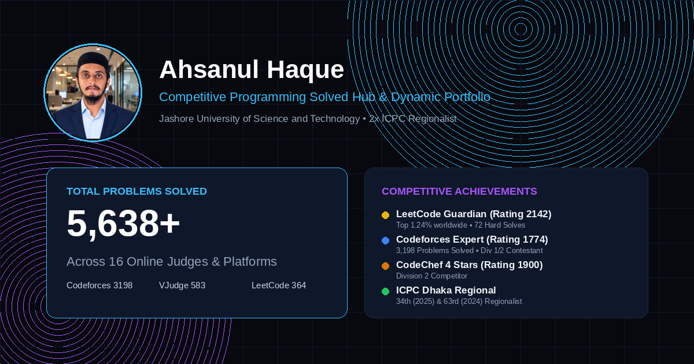

# Competitive Programming Solved Hub ⚡

> **Dynamic real-time problem-solving portfolio tracking 5,616+ solved problems across 14 online judges.**

[](https://ahsanjust.github.io/cp-tracker/)
[](https://ahsanjust.github.io/cp-tracker/)
[](https://leetcode.com/u/Ahsanul_haque_/)
[](https://codeforces.com/profile/Ahsan_)



---

## 🏆 Profile & Competitions
- **Name**: Ahsanul Haque
- **Institution**: Jashore University of Science and Technology (JUST)
- **Competitive Achievements**:
  - 🏅 **ICPC Asia Dhaka Regional:** 34th (2025) & 63rd (2024)
  - 🥇 **JUST IDPC:** Champion (1st Place)
  - 🥈 **NWU IUPC 2025:** 1st Runner-Up
  - ⚡ **LeetCode Guardian:** Rating 2142 (Top 1.24% worldwide)
  - 🎯 **Codeforces Expert:** Rating 1774
  - 🌟 **CodeChef 4 Stars:** Rating 1900
  - 🇧🇩 **Toph:** Rank #39 National

---

## 📊 Online Judges & Current Breakdown

| Platform | Handle | Solved Count | Rating / Rank | Status |
| :--- | :--- | :--- | :--- | :--- |
| **Codeforces** | [`Ahsan_`](https://codeforces.com/profile/Ahsan_) | **3,183** | 1774 (Expert) | Live REST API |
| **Virtual Judge** | [`Ahsan_`](https://vjudge.net/user/Ahsan_) | **583** | 21 Sub-Judges | Live REST API |
| **LeetCode** | [`Ahsanul_haque_`](https://leetcode.com/u/Ahsanul_haque_/) | **364** | 2142 (Guardian) | GraphQL API |
| **Toph** | [`AhSaN.x`](https://toph.co/u/AhSaN.x) | **364** | Rank #39 | Web Scraper / Sync |
| **CodeChef** | [`ahsanul_haque`](https://www.codechef.com/users/ahsanul_haque) | **265** | 1900 (4★) | Web Scraper / Sync |
| **CSES** | [`Ahsanul_Haque`](https://cses.fi/problemset/stats/friends/) | **262** | Rank #2 Friends | Cached / Sync |
| **AtCoder** | [`AHSANx`](https://atcoder.jp/users/AHSANx) | **148** | Rank 45,634 | Kenkoooo API |
| **LightOJ** | [`ahsanul_haque99`](https://lightoj.com/user/ahsanul_haque99) | **133** | 181 ACs | Official REST API |
| **Beecrowd (URI)** | [`ahsanulhaque5588`](https://judge.beecrowd.com/en/) | **105** | 316.60 Points (Top 1%) | Cached / Sync |
| **Serious OJ** | [`_ahsan_`](https://serious-oj.com/user/_ahsan_) | **85** | Rating 650 (Expert) | Web Scraper / Sync |
| **SPOJ** | [`ahsanul_haque`](https://www.spoj.com/users/ahsanul_haque/) | **68** | World Rank #5140 | Cached / Sync |
| **HackerRank** | [`_AhSaN_`](https://www.hackerrank.com/profile/_AhSaN_) | **30** | Problem Solving ★★★ | Official REST API |
| **HackerEarth** | [`ahsanulhaque5588`](https://www.hackerearth.com/@ahsanulhaque5588/) | **14** | Top 18% Data Structures | Web Scraper / Sync |
| **Library Checker** | [`_AhSaN_`](https://judge.yosupo.jp/profile) | **12** | Advanced Algorithms | Cached / Sync |
 
---

## 🛠️ Features
- **Dynamic Odometer**: Animated count-up displaying the aggregate total problem count across all judges.
- **Deduplication Mode**: Toggle to view either the full grand total or the deduplicated count excluding VJudge virtual submissions.
- **Glassmorphic Obsidian Dark Theme**: Tailored with brand color glowing borders and sleek micro-animations.
- **Automated Daily Sync**: GitHub Actions runs daily at midnight UTC to query live APIs, update numbers, and redeploy.

---

## 💻 Running Locally

Clone and run the Python sync server:
```bash
git clone https://github.com/ahsanjust/cp-tracker.git
cd cp-tracker
python3 sync_server.py
```
Open `http://localhost:3333` in your browser.
